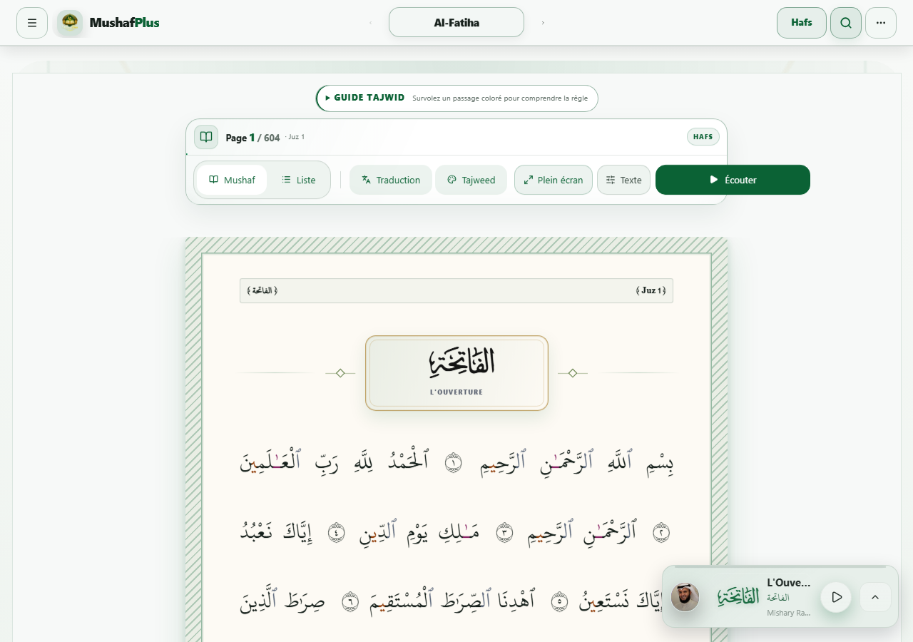
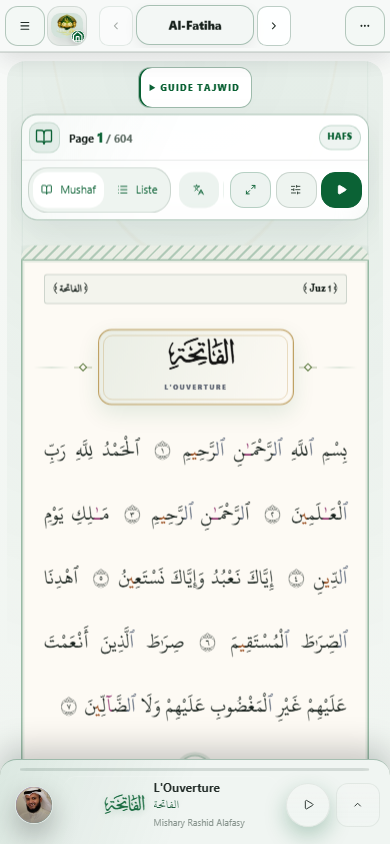
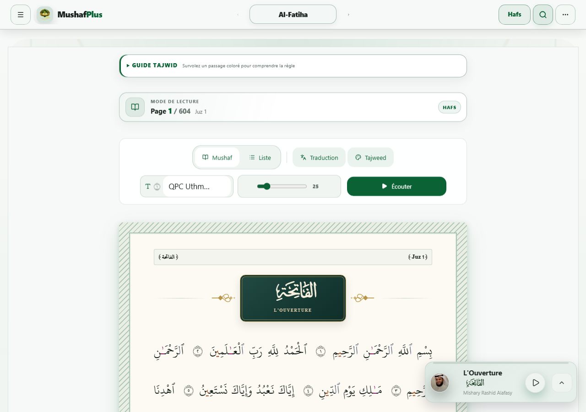

# 📖 MushafPlus — Le Saint Coran en ligne

**Une expérience de lecture du Coran premium, fluide et authentique.**

[](https://github.com/mohamedeyaf820/mon-coran/actions/workflows/tests.yml)
[](https://mushafplus.netlify.app)
[](https://mushafplus.netlify.app)
[](https://github.com/mohamedeyaf820/mon-coran/releases)

---

[](screenshot-desktop.png)
[](screenshot-mobile.png)
[](screenshot-mushaf.png)

---

## ✨ Fonctionnalités

### 📖 Lecture du Coran
- **Double riwaya** : Hafs & Warsh avec données locales authentiques
- **3 modes de lecture** : sourate (scroll continu), page (mushaf 604 pages), juz
- **154 pages** : variantes `liste` et `mushaf` (mise en page page-coran)
- **Police coranique** : QCF4 avec chargement dynamique, taajwid
- **Trilingue** : français, anglais, arabe — RTL complet

### 🎵 Récitation audio
- **54 récitateurs** : Hafs & Warsh, sources MP3Quran
- **Lecture** : verset par verset ou sourate continue
- **Karaoké** : timings mot-à-mot via `quran.com API`
- **Failover** : recitateur alternatif, fallback audio

### 🧰 Outils & Musique
- **Tajwid** : coloration des 9 règles, affichage Cursive OpenType
- **Tafsir** : commentaires islamiques (hors-ligne)
- **Mémorisation** : répétition espacée (`memorizationService.js`)
- **Notes, favoris, signets, bibliothèque personnelle**
- **Séries de lecture** (streaks), verset du jour, reprise automatique
- **Recherche** plein texte, index thématique, du'as
- **Export / import JSON** des notes et favoris

### 🔒 Vie privée & Fonctionnalités avancées
- **Mode protégé** : verrouillage par phrase secrète + chiffrement AES
- **Aucune donnée envoyée** : PWA purement statique
- **Hors-ligne** : service worker, cache IndexedDB, PWA installable
- **CSP stricte** : build-time injection, allowlist CDN audio
- **Thèmes** : clair, sépia, sombre — `theme-aware`
- **Raccourcis clavier**, mode plein écran

### 🌍 Internationalisation
| Langue | Interface | RTL |
|--------|-----------|-----|
| 🇫🇷 Français | par défaut | ❌ |
| 🇬🇧 Anglais | | ❌ |
| 🇸🇦 Arabe | texte | ✅ |

---

## 🛠️ Stack technique

**Frontend** : React 18.3 + Vite 8.2 (Rollup/Oxc) + Tailwind CSS 4.3  
**UI** : Radix UI + Lucide Icons + Glassmorphism v2  
**Data** : localStorage + IndexedDB (idb)  
**Crypto** : AES via CryptoJS  
**Tests** : Node.js test runner + Playwright 1.62 + axe-core  
**CI** : Lint, coverage, build:ci, budgets, CSP + security headers

### Architecture
- SPA statique pure : **aucun backend** nécessaire
- `AppContext` + `useReducer` + sélecteurs `shallowEqual`
- Code splitting agressif : modaux/ panneaux `React.lazy()`
- Bundes Ráfraîchissement : 1275 KiB JS max, 890 Ki CSS max, 810 Ki payload
- 3 niveaux de cache : InMemory → IndexedDB → LocalStorage

---

## 🚀 Démarrage rapide

```bash
# Prérequis : Node.js 22+
git clone https://github.com/mohamedeyaf820/mon-coran.git
cd mon-coran
npm install

# Développement (port 3002)
npm run dev

# Build production (port 4173 pour preview)
npm run build
npm run preview
```

---

## 📋 Scripts npm

| Script | Description |
|--------|-------------|
| `npm run dev` | Serveur dev (http://localhost:3002) |
| `npm run build` | Build prod + purge CSS + pages SEO + audit perfs |
| `npm run build:ci` | Build + vérif budgets CSS/JS/payload + CSS audit + CSP |
| `npm run preview` | Preview du build prod (port 4173) |
| `npm run lint` | ESLint (quiet, cache) |
| `npm run test:security` | Tests unitaires/sécurité avec couverture |
| `npm run test:coverage` | Tests + couverture de code |
| `npm run test:e2e` | Suite E2E complète Playwright |
| `npm run test:e2e:smoke` | Smoke tests : fallback audio + a11y |
| `npm run qa:smoke` | Combiné : smoke + lecture + sécurité |
| `npm run perf:budget` | Vérif budgets bundle |
| `npm run audit:warsh` | Vérif données Warsh (tajwid + audio) |
| `npm run audit:headers` | Vérif headers de sécurité |

> ⚠️ Les tests E2E nécessitent un build (`npm run build`) avant d'exécuter.

---

## 🧪 Qualité & Tests

- **46+ tests** unitaires et sécurité (Node.js test runner)
- **60+ scénarios** E2E Playwright (lecture, audio, responsive, a11y, régression)
- **CI** : GitHub Actions → `main` ET `master`, `perf/load-times-and-bug-fixes`
- **Coverage** : `npm run test:coverage` → rapport HTML dans `coverage/`

---

## 📦 Structure du projet

```
src/
├── App.jsx               # Point d'entrée + routes
├── components/           # Composants React
│   ├── AudioPlayer.jsx   # Player audio complet
│   ├── QuranDisplay/     # Modes Surah / Page / Juz
│   └── ...
├── context/AppContext.jsx
├── i18n/                 # fr.js, en.js, ar.js
├── services/             # API, audio, storage, tafsir
└── styles/               # Tailwind + custom CSS
public/
├── manifest.json         # PWA manifest
├── icons/*.png           # PWA icons
└── screenshots/          # Images docs
tests/
└── e2e/                  # Scénarios Playwright
docs/                     # ARCHITECTURE.md, ROADMAP.md, QUICK_START.md
```

---

## 🗺️ Roadmap

Les 8 phas ont été **terminés et validés** en CI (juillet-août 2026) :

| Phase | Description | Statut |
|-------|-------------|--------|
| 0 | Stabilisation initiale | ✅ |
| 1 | Lecture fluide & performance | ✅ |
| 2 | Audio modularisé | ✅ |
| 3 | Design system documenté | ✅ |
| 4 | Home, navbar, footer | ✅ |
| 5 | 54 profils réciteurs | ✅ |
| 6 | Sécurité avancée (AES) | ✅ |
| 7 | Bibliothèque personnelle | ✅ |
| 8 | Transitions audio rapides | ✅ |

➡️ Voir [ROADMAP.md](./ROADMAP.md) pour les détails.

---

## 🌐 Sites déployés

- **Site principal (Netlify)** : https://mushafplus.netlify.app
- **Code source** : https://github.com/mohamedeyaf820/mon-coran

---

## 🤝 Contribution

1. Fork → branche → commits atomiques (`docs(readme):` pour docs)
2. Tests passent (`npm run qa:smoke`)
3. Build CI vert (`npm run build:ci`)
4. Pull Request ouverte

Voir [ARCHITECTURE.md](./ARCHITECTURE.md) pour la documentation technique complète.

---

## 📄 Licence

Ce projet n'a pas encore de licence explicite. Par défaut, les droits sont réservés.  
Pour tout usage ou partage, veuillez ouvrir une issue sur GitHub.

---

<details>
<summary>⚙️ Configuration technique (développeurs)</summary>

### Variables d'environnement
| Variable | Description |
|----------|-------------|
| `VITE_API_BASE` | Base URL pour les appels API (défaut: prod) |
| `VITE_DEV_PORT` | Port dev (défaut: 3002) |

### Configuration Vite (vite.config.js)
- Plugins : `@vitejs/plugin-react`, `@tailwindcss/vite`
- Build : ROLLUP + OXC minifier, sourcemap false prod
- Preview server : port 4173

### CSP (Content Security Policy)
Injectée au build via `scripts/cspPolicy.mjs` :
```html
<meta http-equiv="Content-Security-Policy" content="...">
```
- Audio CDN allowlist : mp3quran.com, quran.com, etc.
- Strict script-src 'self'

### PWA Manifest
- `display: standalone` — app installables
- 3 skins : favicon, maskable, apple-touch-icon
- Shortcuts : Al-Fatiha, Al-Mulk, Al-Kahf

</details>

---

<div align="center">

⭐ Si MushafPlus vous plaît, étoilez-le ! | 🌐 [Site](https://mushafplus.netlify.app) | 🐛 [Problèmes](https://github.com/mohamedeyaf820/mon-coran/issues)

</div>