<div align="center">

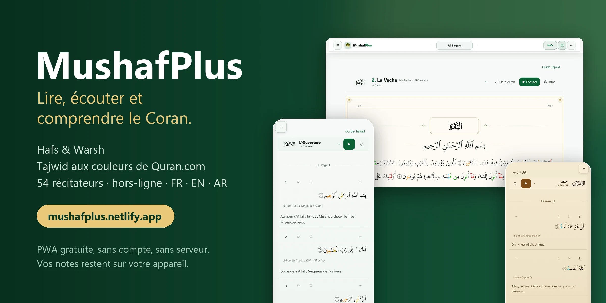

# MushafPlus

**Lire, écouter et comprendre le Coran — sans compte, sans serveur, sans publicité.**

Hafs & Warsh · Tajwid aux couleurs de Quran.com · 54 récitateurs · hors-ligne · français, anglais, arabe (RTL natif)

[](https://github.com/mohamedeyaf820/mon-coran/actions/workflows/tests.yml)
[](https://mon-coran.vercel.app)
[](https://mon-coran.vercel.app)
[](https://react.dev)
[](https://vite.dev)
[](https://tailwindcss.com)
[](https://github.com/mohamedeyaf820/mon-coran/releases)

**[Ouvrir l'application](https://mon-coran.vercel.app)** ·
**[Fonctionnalités](#-fonctionnalités)** ·
**[Démarrer](#-démarrer-en-2-minutes)** ·
**[Architecture](#-architecture)** ·
**[Contribuer](CONTRIBUTING.md)**

</div>

<details>
<summary><b>English summary</b></summary>

MushafPlus is a free, static Progressive Web App for reading and listening to the Quran. It supports the **Hafs** and **Warsh** riwayat, a Tajweed colouring that follows **Quran.com's rules and palette** (verified word by word, the Quran text is never altered), 54 reciters, word-by-word audio, offline reading and downloads, French / English / Arabic (native RTL), three themes and an optional passphrase lock (PBKDF2 + AES). There is **no backend and no account**: everything you write stays in your browser. Quick start: `npm install && npm run dev`. The documentation below is in French; code, tests and commit messages are in English or French.

</details>

---

## ✨ En bref

| | |
|---|---|
| 📖 **Deux riwayat** | Hafs et Warsh, chacun avec ses polices, sa numérotation de versets et ses règles de Tajwid propres. |
| 🎨 **Tajwid fidèle** | Les règles et les couleurs de Quran.com, appliquées à **chaque police Hafs**, avec une garantie d'intégrité : la couleur ne modifie jamais une lettre. |
| 🎧 **Récitations** | 54 récitateurs (46 Hafs, 8 Warsh), lecture verset par verset ou sourate continue, suivi mot à mot, téléchargement hors-ligne validé. |
| 📴 **Hors-ligne** | PWA installable, service worker, texte et audio en cache, tafsir français relisible hors ligne après une première lecture. |
| 🔒 **Privé par conception** | Aucun compte, aucune synchronisation cloud. Verrouillage optionnel par phrase secrète (PBKDF2 600 000 itérations + AES). |
| 🌍 **Trilingue** | Français, anglais, arabe avec bascule RTL native — pas de miroir approximatif. |

---

## 📸 Aperçu

Une seule application, trois formats : l'interface s'adapte au téléphone (barre de navigation du bas), à la tablette (portrait et paysage) et à l'ordinateur (en-tête complet).

### 📱 Téléphone

<p align="center">
  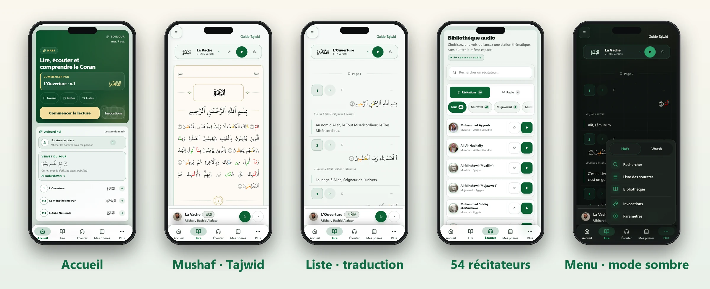
</p>
<p align="center">
  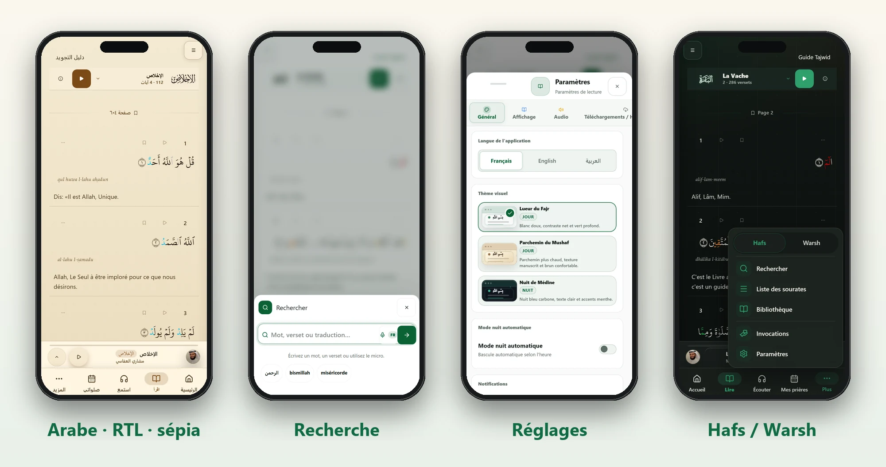
</p>

### 📲 Tablette

<p align="center">
  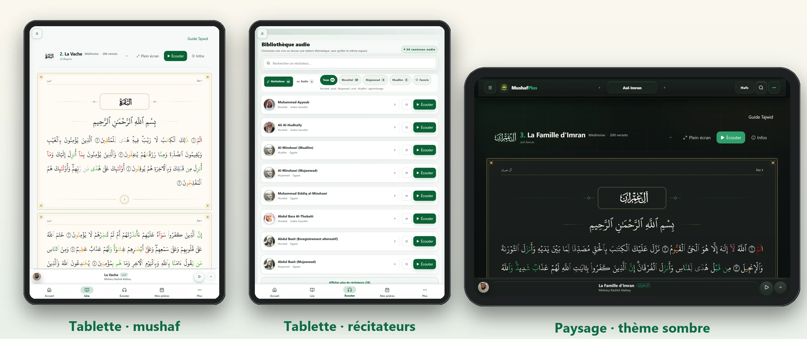
</p>

### 🖥️ Ordinateur

<p align="center">
  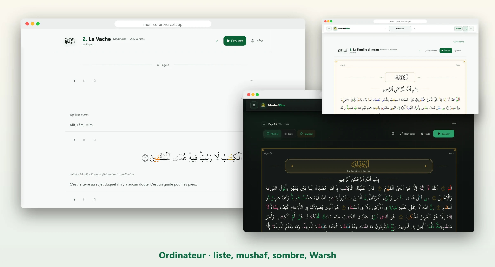
</p>

<table>
  <tr>
    <td width="50%">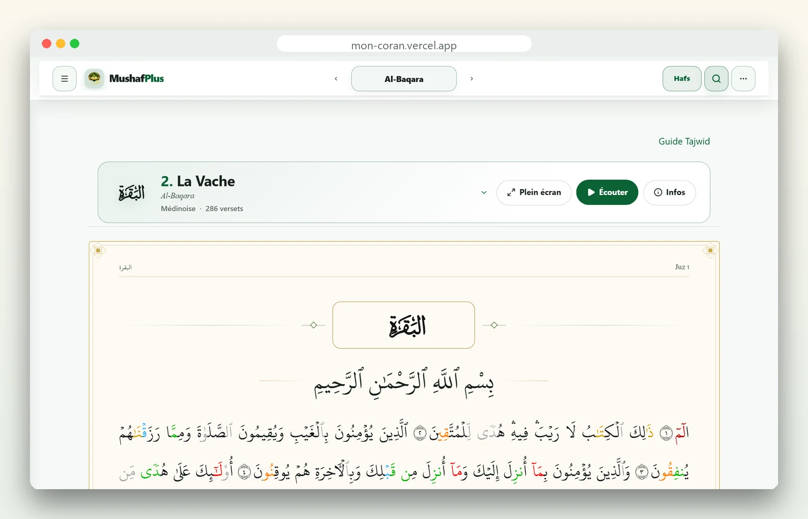<br><sub><b>Mode mushaf</b> — page encadrée, Tajwid aux couleurs de Quran.com</sub></td>
    <td width="50%">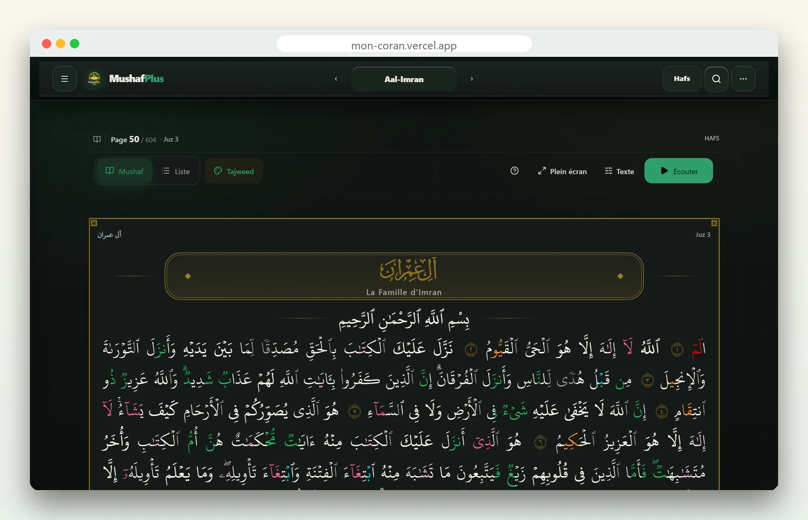<br><sub><b>Thème sombre</b> — « Nuit de Médine », pensé pour la lecture longue</sub></td>
  </tr>
  <tr>
    <td width="50%">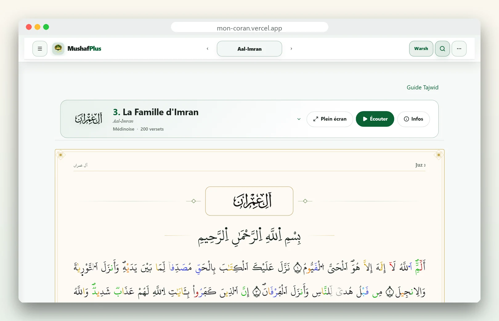<br><sub><b>Warsh</b> — police et règles de Tajwid propres à la riwaya</sub></td>
    <td width="50%">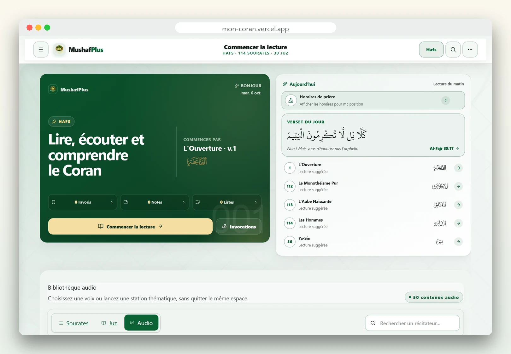<br><sub><b>Audio</b> — 54 récitateurs, radio, filtres de style</sub></td>
  </tr>
  <tr>
    <td width="50%">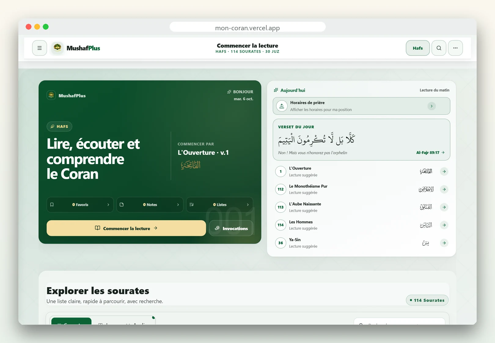<br><sub><b>Accueil</b> — reprise exacte de la dernière position, verset du jour</sub></td>
    <td width="50%">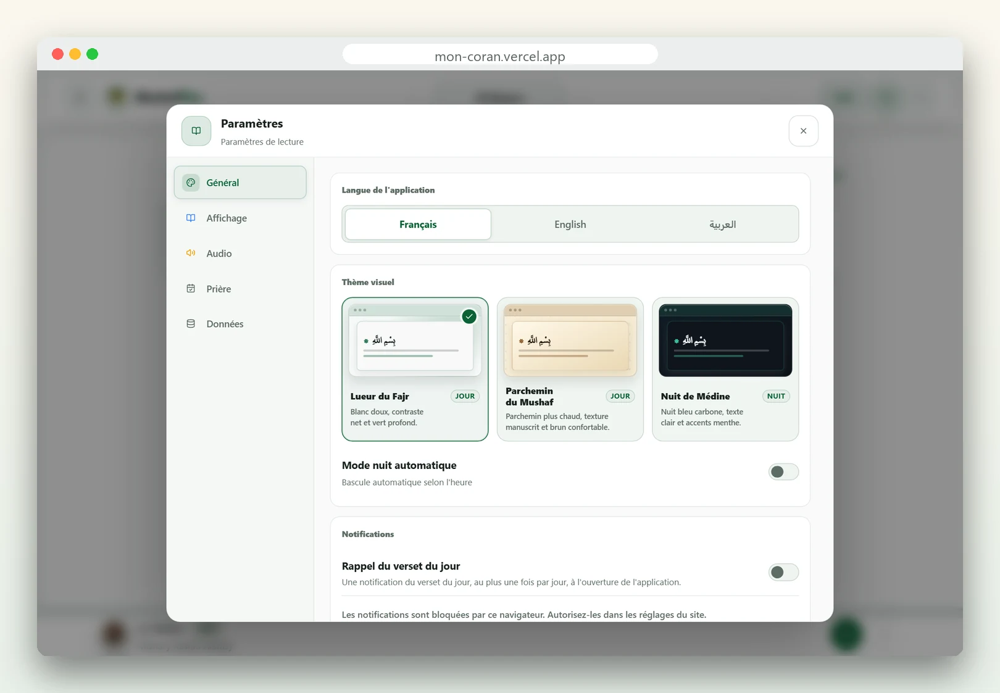<br><sub><b>Réglages</b> — langue, trois thèmes, mode nuit, audio, confidentialité</sub></td>
  </tr>
</table>

---

## 🧭 Fonctionnalités

### 📖 Lecture
- **Trois modes** : sourate (défilement continu), page (les 604 pages du mushaf), juz.
- **Deux présentations** : *liste* (un verset par bloc, avec traduction et translittération) et *mushaf* (mise en page de page imprimée, plein écran inclus).
- **Reprise exacte** là où vous vous êtes arrêté, y compris après rechargement ou hors-ligne.
- **Cinq polices Hafs** (QPC Uthmani, IndoPak Nastaleeq, Scheherazade New, Amiri Quran, Noto Naskh) et deux polices Warsh, avec réglage de taille.
- **Recherche** par référence (`2:255`), par texte arabe ou par mot, recherche vocale.
- **Informations de sourate** : dossier éditorial, lieu de révélation, nombre de versets.

### 🎨 Tajwid
- Coloration issue **exclusivement** de l'annotation officielle de Quran.com (`text_uthmani_tajweed`), jamais d'une détection par motifs : on ne devine pas une règle de récitation.
- **Mêmes couleurs que Quran.com** dans les trois thèmes, légende et guide intégrés.
- Fonctionne sur **toutes les polices Hafs**. Les éditions n'écrivent pas les signes de la même façon ; un aligneur mot à mot reporte chaque règle sur le texte réellement affiché (≈ 99,9 % des mots annotés, mesuré sur les 6 236 versets).
- **Garantie d'intégrité** : seuls les intervalles de couleur bougent, le texte du Coran n'est jamais réécrit. Un mot dont les lettres ou les voyelles ne correspondent pas reste sans couleur et est signalé.
- **Warsh** : règles dérivées du Dabt de l'édition épinglée et d'une archive vérifiable ([audit](docs/WARSH_TAJWEED_USER_ARCHIVE_AUDIT.md)).

### 🎧 Audio
- **54 récitateurs** avec portrait, biographie sourcée et filtre de style (murattal, mujawwad, muallim).
- Lecture verset par verset ou sourate continue, **suivi mot à mot** (karaoké), basmala automatique, bascule de secours si un CDN échoue.
- **Mémorisation** : répétition A-B, répétition de la sourate (0 = infinie), nombre de répétitions réglable.
- **Téléchargements hors-ligne validés** : un fichier n'est déclaré disponible que s'il est un flux MP3 complet et lisible.
- Contrôles écran verrouillé (Media Session) et lecteur persistant entre les écrans.

### 📚 Étudier et suivre
- **Tafsir** (français Al-Mukhtasar via QuranEnc.com, conservé sur l’appareil après lecture) et sources Quran.com, traductions et translittération.
- **Favoris, notes, listes** ; export / import JSON.
- **Partage d'un verset en image** (formats et réseaux, PNG réel).
- **Horaires de prière**, adhan optionnel, suivi des prières, invocations (du'as).

### 📱 Interface
- **Mobile d'abord** : barre de navigation du bas, zones tactiles ≥ 44 px, en-tête qui s'efface en lecture.
- **Trois thèmes** (jour, sépia, nuit), mode nuit automatique, cibles tactiles et contrastes testés.
- Raccourcis clavier, plein écran, accessibilité vérifiée par axe-core.

---

## 🔒 Confidentialité et sécurité

- **Aucun compte, aucune synchronisation, aucun traceur.** Les préférences, la position, les notes et les favoris vivent dans `localStorage` / IndexedDB.
- **Mode protégé (optionnel)** : phrase secrète → clé dérivée par PBKDF2-HMAC-SHA-256 (600 000 itérations, sel de 256 bits) ; enveloppe AES-256-CBC + HMAC-SHA-256 ; la clé reste en mémoire le temps de la session. Pas de récupération possible : exportez une sauvegarde avant d'activer.
- **Mode par défaut** : clé d'appareil aléatoire — empêche la lecture casuelle, **pas** un coffre-fort (voir les limites dans [`docs/SECURITY_PRIVACY.md`](docs/SECURITY_PRIVACY.md)).
- **CSP stricte** (`script-src 'self'`), HSTS, `X-Frame-Options: DENY`, COOP, Permissions-Policy ; un test garantit que Netlify et Vercel servent exactement les mêmes en-têtes.
- Géolocalisation demandée **uniquement** après activation explicite des horaires de prière.
- `npm audit` : 0 vulnérabilité sur les dépendances de production au moment de la rédaction.

Signalement d'une faille : voir [SECURITY.md](SECURITY.md).

---

## ⚡ Performance

Mesures faites sur le build de production (réseau réel, Chromium) :

| Mesure | Valeur |
|---|---|
| JS du point d'entrée | ≈ 143 kB (le français est embarqué, l'anglais et l'arabe se chargent à la demande) |
| Premier verset visible (sourate 2) | ≈ 1 s |
| Accueil : premier affichage | ≈ 0,3 s |
| Défilement en mode page | ≈ 60 images/s |
| CSS livré | ≈ 1,0 Mo, réparti en feuilles chargées par écran |

Leviers : découpage par écran (`React.lazy`), dictionnaires par langue, mise en cache en trois niveaux (mémoire → IndexedDB → localStorage), `content-visibility` sur les longues listes, peinture Tajwid groupée en un seul calcul de mise en page par lot, budgets de bundle vérifiés en CI.

---

## 🏗️ Architecture

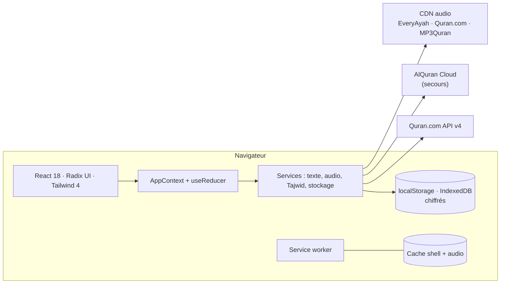

- **SPA statique** : aucun backend. Déployée sur Netlify (et Vercel), `npm run build` produit aussi les pages SEO.
- **Source du texte** : Quran.com en priorité, AlQuran Cloud en secours, texte de secours embarqué pour la Fatiha. Les trois chemins passent par les mêmes garde-fous d'intégrité (Basmala, marqueurs de verset, alignement du Tajwid).
- **Tajwid** : `tajwidAnnotation` (lecture de l'annotation) → `tajwidAlignment` (report sur le texte affiché) → `tajweedWordPaint` (peinture par dégradé de texte, un mot reste un seul bloc de texte pour ne pas casser le façonnage arabe).

```
src/
├── App.jsx · main.jsx        # coque, routage, boot (langue chargée avant le premier rendu)
├── components/
│   ├── QuranDisplay/         # modes sourate / page / juz, mushaf, plein écran
│   ├── Quran/                # rendu d'un verset, Tajwid, légende
│   ├── audioPlayer/ · recitation/ · settings/ · Home/ · ui/
├── context/AppContext.jsx    # état global et persistance
├── data/                     # sourates, récitateurs, polices, palette Tajwid
├── i18n/                     # fr (embarqué), en et ar (chargés à la demande)
├── services/                 # API Quran.com, audio, téléchargements, stockage, crypto
├── utils/                    # alignement Tajwid, peinture, mots, Basmala
└── styles/                   # Tailwind 4 + feuilles par domaine
public/                       # manifest, polices, données Warsh, sw.js
tests/ · tests/e2e/           # unitaires (Node) · scénarios Playwright
scripts/                      # audits, build SEO/budgets, captures du README
```

Documentation détaillée : [ARCHITECTURE.md](ARCHITECTURE.md) · [Design system](docs/DESIGN_SYSTEM.md) · [Sécurité et vie privée](docs/SECURITY_PRIVACY.md) · [Audit Tajwid Hafs/Warsh](docs/TAJWID_HAFS_WARSH_AUDIT.md) · [Audio hors-ligne](docs/OFFLINE_AUDIO_REFACTOR.md).

---

## 🚀 Démarrer en 2 minutes

Prérequis : **Node.js 22+**.

```bash
git clone https://github.com/mohamedeyaf820/mon-coran.git
cd mon-coran
npm install
npm run dev            # http://localhost:3002
```

Build de production et aperçu :

```bash
npm run build
npm run preview        # http://localhost:4173
```

### Scripts utiles

| Commande | Rôle |
|---|---|
| `npm run dev` | Serveur de développement (3002) |
| `npm run build` | Build + purge CSS + pages SEO + audit de performance |
| `npm run build:ci` | Build + budgets (CSS/JS/charge) + audit CSS + en-têtes |
| `npm run lint` | ESLint |
| `npm run test:security` | Tests unitaires et contrats (Node test runner) |
| `npm run test:coverage` | Idem avec couverture |
| `npm run test:e2e` | Suite Playwright complète (Chromium, Firefox, WebKit, PWA) |
| `npm run test:e2e:smoke` | Audio de secours + accessibilité |
| `npm run perf:budget` | Budgets de bundle |
| `npm run audit:warsh` | Vérification des données Warsh (texte, Tajwid, audio) |
| `npm run audit:headers` | En-têtes de sécurité |

> Les tests e2e s'exécutent sur le build de production : lancez `npm run build` d'abord.

---

## 🧪 Qualité

- **≈ 520 tests unitaires et contrats** : intégrité du texte coranique et du Tajwid, chiffrement, crypto, budgets tactiles, parité des en-têtes de déploiement, i18n (parité des clés FR/EN/AR).
- **≈ 60 fichiers de scénarios e2e** (≈ 285 tests) sur Chromium, Firefox, WebKit et en PWA hors-ligne : lecture, audio, téléchargements, responsive, RTL, accessibilité (axe-core), régression visuelle.
- **CI** (GitHub Actions) : lint, tests avec couverture, build + budgets, audit des dépendances, vérification des données Warsh.
- Preuves de non-régression CSS : [`scripts/snapshot-computed-styles.mjs`](scripts/snapshot-computed-styles.mjs) compare le style calculé de chaque élément entre deux builds.

---

## 🗺️ Feuille de route

Les huit phases initiales (stabilisation, lecture fluide, audio modulaire, design system, accueil, récitateurs, sécurité, bibliothèque) sont **terminées**. Récemment : Tajwid fidèle à Quran.com sur toutes les polices Hafs, navigation mobile, téléchargements hors-ligne validés, dictionnaires par langue. Voir [ROADMAP.md](ROADMAP.md).

---

## 🙏 Sources et crédits

Texte, mots et métadonnées : **Quran.com** (Quran Foundation) et **AlQuran Cloud**. Audio : Quran.com, EveryAyah, MP3Quran, QuranicAudio, Islamic Network. Polices : QPC / KFGQPC, Scheherazade New, Amiri Quran, Noto Naskh. Adhan : *Islamic call to prayer from the Prophet Mosque* (ejaz215, CC BY 3.0, Wikimedia Commons). Détail et attributions : [THIRD_PARTY_NOTICES.md](THIRD_PARTY_NOTICES.md). Les contenus restent soumis aux droits et licences de leurs propriétaires.

## 🤝 Contribuer

Les contributions sont les bienvenues — lisez [CONTRIBUTING.md](CONTRIBUTING.md) (règles propres à un projet coranique incluses : jamais de texte coranique modifié, jamais de règle de Tajwid devinée). Bugs et idées : [issues](https://github.com/mohamedeyaf820/mon-coran/issues).

## 📄 Licence

Le dépôt ne déclare **pas encore de licence** de redistribution du code : par défaut, tous droits réservés. Pour un usage ou un partage, ouvrez une issue. Les ressources tierces gardent leurs licences d'origine.

<details>
<summary>⚙️ Notes techniques</summary>

- Aucune variable d'environnement n'est requise : l'application est statique et appelle directement les API publiques.
- Plugins Vite : `@vitejs/plugin-react`, `@tailwindcss/vite`.
- Les captures et visuels du README se régénèrent avec `node scripts/capture-readme-screenshots.mjs` puis `python scripts/build-readme-images.py` (build de production et `npm run preview` requis).

</details>
